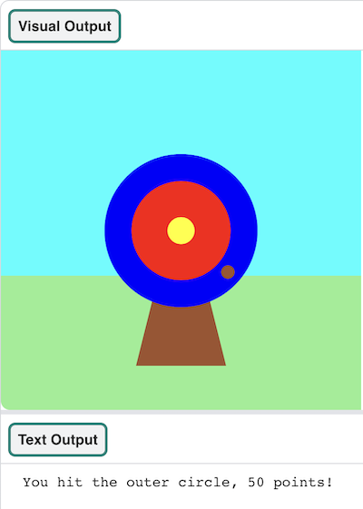

  <a class="c-survey-banner__link" href="https://form.raspberrypi.org/f/code-editor-feedback" target="_blank">Take our survey</a> to help make our Code Editor better!

## You will make

Use Python and the `p5` graphics library, to draw a target. Score points by hitting it with arrows. 

--- no-print ---

### Play ▶️

--- task ---

  

Click the **Run** button below to start the game. When the dot appears on the target 🎯, click the mouse (or tap on your tablet) to fire your arrow. 

  <iframe src="https://editor.raspberrypi.org/en/embed/viewer/target-practice-solution" width="600" height="600" frameborder="0" marginwidth="0" marginheight="0" allowfullscreen>
  </iframe>

**Tip:** 💡 When you press **Stop** you will see a prompt that says 'Execution interrupted'. This just means that you have stopped the program whilst the code was still running. 

--- /task ---

--- /no-print ---

--- print-only ---

{:width="640px"}

--- /print-only ---

The oldest evidence of  archery  comes from South Africa. Stone and bone arrowheads aged around 70,000 years old have been found. 

