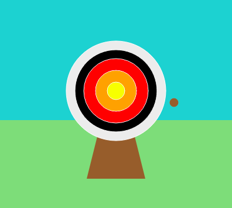

## Upgrade your project

Personalise and add more to your project. Perhaps you could change the difficulty level or add more circles to your target.

{:width="300px"}

--- task ---

You could:

+ Add a `fourth` and `fifth` circle, in new colours, which score different amounts of points based on their position 🟠🟣
+ Put emojis in your `print()` messages ([here is a list of emojis](https://unicode.org/emoji/charts/full-emoji-list.html){:target="_blank"} you can copy from) 🎯
+ Change the `frame_rate=2` value to make the game easier or harder 💨
+ Use `input()` to ask the user which difficulty level they want to play at 🗣️

--- /task ---

--- collapse ---
---
title: Completed project
---

You can view the [completed project here](https://editor.raspberrypi.org/projects/target-practice-solution){:target="_blank"}.

--- /collapse ---
