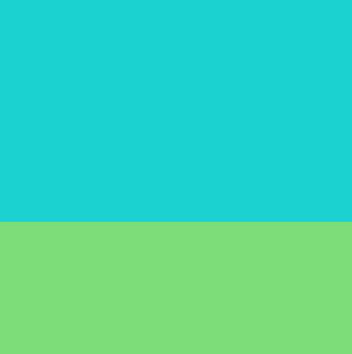

## Create a background

{:width="300px"}

### Open the starter project

--- task ---

Open the [Target practice starter](https://editor.raspberrypi.org/en/projects/target-practice-starter){:target="_blank"} project. The code editor will open in another browser tab.

If you have a Raspberry Pi account, click on the **Save** button to save a copy to your **Projects**.

--- /task ---

### Edit the sky

--- task ---

The starter project has code already written for you. 

Click **'Run'** to see a blue filled rectangle which is the sky in your project. 

{:width="400px"}

--- /task ---

--- task ---

The sky has been drawn with a black border (stroke). 

Turn the stroke off for all shapes. Add `no_stroke()` to the `setup` function:

--- code ---
---
language: python
line_numbers: true
line_number_start: 9
line_highlights: 12
---
def setup():
# Setup your game here
    size(400, 400)  # Width and height of screen
    no_stroke()

--- /code ---

--- /task ---

--- task ---

**Run** your code again and notice 👀 that the border (stroke) has now disappeared.

**Tip:** 💡 You will need to press **Stop** to stop your program, this will make the **Run** button reappear. 

**Tip:** 💡 Coordinates start from (x=0, y=0) in the top left corner. This might be different to other coordinate systems you have used. 

--- /task ---