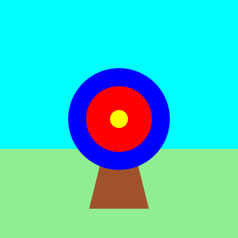
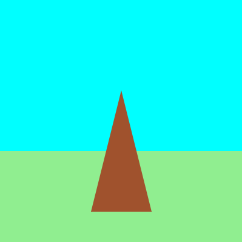
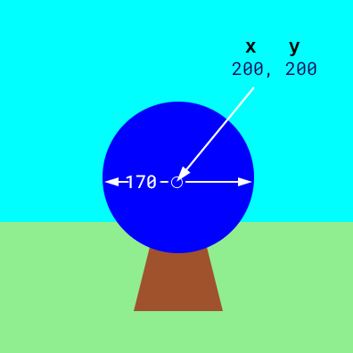
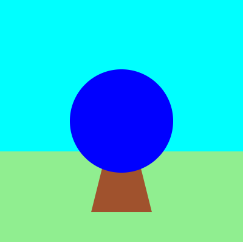
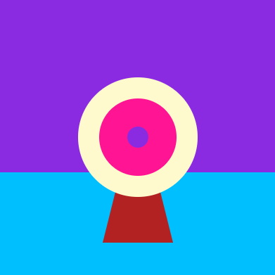

## Draw your target

{:width="300px"}

### Draw a triangular stand
Your game needs a target to shoot arrows at.

--- task ---

Set the fill colour to `sienna` (brown). 

Draw a triangle using the x and y coordinates for each of the corners.

{:width="400px"}

--- code ---
---
language: python
line_numbers: true
line_number_start: 18
line_highlights: 20, 21
---
    fill('lightgreen')  # Set the fill colour for the grass to light green
    rect(0, 250, 400, 150)  # Draw a rectangle for the grass with these values for x, y, width, height
    fill('sienna')  # Brown colour
    triangle(150, 350, 200, 150, 250, 350)  # Draw a triangle for the target's stand

--- /code ---

--- /task ---

--- task ---

**Test:** 🔄 Run your code to see the stand for your target.

{:width="400px"}

--- /task ---

### Draw the target circles

--- task ---

The largest part of the target is a blue **circle**.

Set the fill colour to `blue`. 

Draw a circle with x and y coordinates for its centre and a width.

{:width="400px"}

--- code ---
---
language: python
line_numbers: true
line_number_start: 20
line_highlights: 22, 23
---

    fill('sienna')  # Brown colour
    triangle(150, 350, 200, 150, 250, 350)  # Draw a triangle for the target's stand 
    fill('blue')  # Set the circle fill colour to blue
    circle(200, 200, 170)  # Draw the outer circle
  
--- /code ---

--- /task ---

--- task ---

**Test:** 🔄 Run your code to see the first large blue circle. 

The blue circle was drawn after the stand, so it is in front.

{:width="400px"}

--- /task ---

The target is made of different-sized circles with the same coordinates for the centre (200, 200).

--- task ---

**Add** coloured circles for the inner and middle parts of the target.

--- code ---
---
language: python
line_numbers: true
line_number_start: 20
line_highlights: 24, 25
---

    fill('sienna')  # Brown colour
    triangle(150, 350, 200, 150, 250, 350)  # Draw a triangle for the target's stand 
    fill('blue')  # Set the circle fill colour to blue
    circle(200, 200, 170)  # Draw the outer circle
    fill('red')  # Set the colour for the circle fill to red
    circle(200, 200, 110)  # Draw the inner circle using x, y, width
    fill('yellow')  # Set the colour for the circle fill to yellow      
    circle(200, 200, 30)  # Draw the middle circle using x, y, width

--- /code ---

--- /task ---

--- task ---

**Test:** 🔄 Run your project to see the target with three coloured circles.

{:width="400px"}

--- /task ---

--- collapse ---

---
title: Change the colours in your project
---

To change any of the colours, use a different colour name. You can find a list of all of the available colour names on [W3Schools](https://www.w3schools.com/colors/colors_names.asp){:target="blank"}. 

{:width="400px"}

Example code using different colours:

--- code ---
---
language: python
line_numbers: false
line_number_start: 14
line_highlights: 
---
    
def draw():
# Things to do in every frame
    fill('BlueViolet')
    rect(0, 0, 400, 250)  # Sky
    fill('DeepSkyBlue')
    rect(0, 250, 400, 150)  # Ground
    fill('FireBrick')
    triangle(150, 350, 200, 150, 250, 350)  # Stand
    fill('LemonChiffon')
    circle(200, 200, 170)  # Outer circle
    fill('DeepPink')
    circle(200, 200, 110)  # Inner circle
    fill('BlueViolet')
    circle(200, 200, 30)  # Middle circle
  
--- /code ---

--- /collapse ---

--- save ---