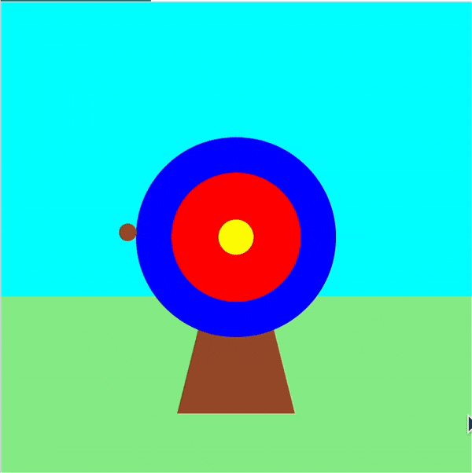
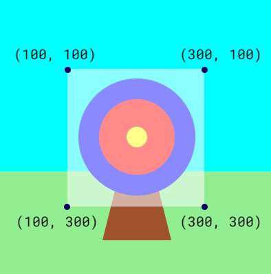

## Fire your arrow

{:width="300px"}

### Draw a target circle every frame

 Computers create the effect of movement by showing lots of images one after another. Each image is called a frame.  

--- task ---

Define your `shoot_arrow()` function under the comment `# The shoot_arrow function goes here`.

Add code to randomly draw a brown circle within a target area:

--- code ---
---
language: python
line_numbers: true
line_number_start: 7
line_highlights: 8-12
---
# The shoot_arrow function goes here    
def shoot_arrow():   
    arrow_x = randint(100, 300)  # Store a random number between 100 and 300    
    arrow_y = randint(100, 300)  # Store a random number between 100 and 300    
    fill('sienna')  # Set the arrow fill colour to brown   
    circle(arrow_x, arrow_y, 15)  # Draw a small circle at random coordinates

--- /code ---

--- /task ---

--- task ---

Go to the `draw()` function and call your new `shoot_arrow()` function. 

--- code ---
---
language: python
line_numbers: true
line_number_start: 31
line_highlights: 33
---
    fill('yellow')  # Set the colour for the circle fill to yellow      
    circle(200, 200, 30)  # Draw the middle circle using x, y, width
    shoot_arrow()

--- /code ---

--- /task ---

--- task ---

**Test:** 🔄 Run your code to see the arrow appear in a random position each frame.

--- /task ---

--- collapse ---

---
title: Why can't I see all the arrows?
---

The background and target are drawn over the old arrow. This means you only see one arrow at a time.

--- /collapse ---

