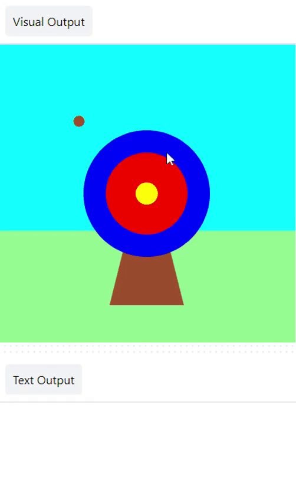

## Score points

Your game will add scores based on where the arrow hits.

{:width="300px"}

`if` conditions let us write code to do something different depending on whether a condition is true or false. In the real world, we make decisions all the time. For example, we could say, "if the pencil is blunt, then sharpen it".

### Display the scores

--- task ---

Delete ❌ the line of code `print('🎯')`.

--- code ---
---
language: python
filename: main.py
line_numbers: true
line_number_start: 5
line_highlights: 7
---
# The mouse_pressed function goes here    
def mouse_pressed():

--- /code ---

--- /task ---

--- task ---

Display a message **if** the `hit_colour` is equal to the `outer` circle colour (blue) 🎯. 

Notice 👀 that the code uses two equals signs `==` to mean **equal to**.

--- code ---
---
language: python
filename: main.py - mouse_pressed()
line_numbers: true
line_number_start: 5
line_highlights: 7, 8
---

# The mouse_pressed function goes here     
def mouse_pressed():     
    if hit_colour == Color('blue').hex:  # Like the code in functions, the code in 'if' statements is indented
        print('You hit the outer circle, 50 points!')

--- /code ---

--- /task ---

--- task ---

**Test:** 🔄 Run your project. Try to fire the arrow on the blue outer circle to see the message. 

--- /task ---
--- collapse ---

---
title: Debug your code
---

**Tip:** If you changed the colour of your outer circle, you will need to replace `'blue'` with the name of the colour you have chosen.

**Tip:** `frame_rate=2`, in `run` at the bottom of your code, controls how fast your game draws. If it is going too fast, set it to a lower number. 

**Debug:** Check that you have used the American spelling of `Color` (without a 'u') and that `Color` has a capital letter.

**Debug:** Make sure your code matches exactly and you have indented the code inside your `if` statement. 

**Debug:** Make sure you have entered the correct colour name you used for **your** outer circle. 

--- /collapse ---
