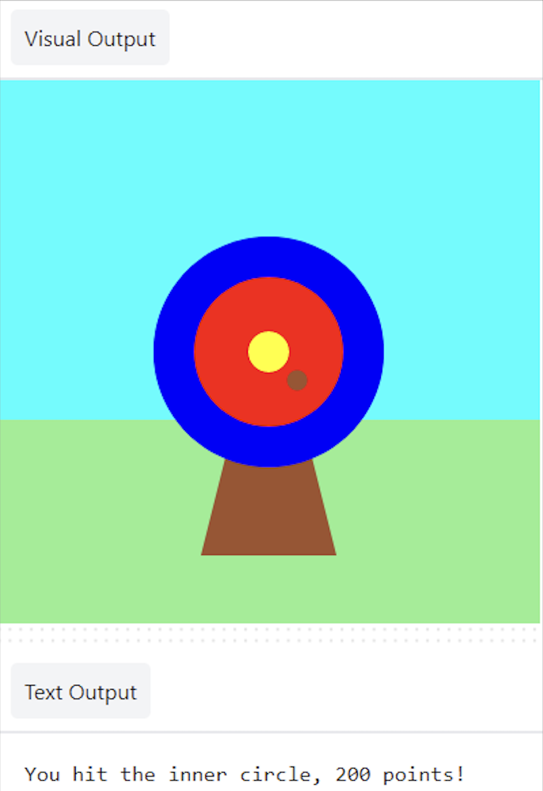

## Add more conditions

`elif` (else - if) can be used to add more conditions to your `if` statement. These will be read from top to bottom. As soon as a **True** condition is found, it will be actioned. Any remaining conditions will be ignored.

--- task ---

Score points if the arrow lands on the `inner` or `middle` circles 🎯: 

--- code ---
---
language: python
filename: main.py - mouse_pressed()
line_numbers: true
line_number_start: 6
line_highlights: 9-12
---

def mouse_pressed():
    if hit_colour == Color('blue').hex:   
        print('You hit the outer circle, 50 points!')
    elif hit_colour == Color('red').hex:
        print('You hit the inner circle, 200 points!')
    elif hit_colour == Color('yellow').hex:
        print('You hit the middle, 500 points!')

--- /code ---

--- /task ---

--- task ---

**Test:** 🔄 Run your project. Try to fire the arrow on the inner and middle circles to see their messages.

**Debug:** 🐞 Check your indentation matches the example.

**Debug:** 🐞 If you see a message about `hit_colour` being 'not defined', then go back to `draw()` and check that the line declares `hit_colour` as a global variable.

**Debug:** 🐞 Make sure that you have entered the correct colour name for **your** circles. 

**Debug:** 🐞 Make sure that you have used the `.hex` string for **your** circle colours. 

--- /task ---

### Missing the target

There is one more decision you need to make: what happens if the arrow does not land on any of the target circles? ❌ 

To do this last check, you use `else`.

--- task ---

Add code to `print` a message `else` none of the `if` and `elif` statements have been met.

--- code ---
---
language: python
filename: main.py
line_numbers: true
line_number_start: 6
line_highlights: 13-14
---

def mouse_pressed():
    if hit_colour == Color('blue').hex:   
        print('You hit the outer circle, 50 points!')
    elif hit_colour == Color('red').hex:
        print('You hit the inner circle, 200 points!')
    elif hit_colour == Color('yellow').hex:
        print('You hit the middle, 500 points!')
    else:   
        print('You missed! No points!')

--- /code ---

--- /task ---

--- task ---

**Test:** 🔄 Run your project. Fire the arrow in the grass or sky to see the miss message. 

**Choose:** 💭 Change the number of points scored for the different colours.

--- /task ---

--- save ---